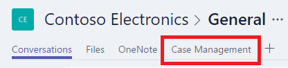

# 在 Microsoft Teams 中添加并打开应用
将应用添加到 Microsoft Teams 频道，以便应用的所有共享对象都可以在此频道中打开应用。 可以添加自己生成或拥有“可使用”或“可编辑”权限的任何应用，并能在浏览器或 Microsoft Teams 相关桌面应用中添加和打开应用。

## 添加应用
1. 与团队其他成员[共享应用](share-app.md)。
2. 在 Microsoft Teams 中，选择一个团队及其频道。
   
    
3. 单击或点击“+”，添加选项卡。
   
    
4. 在“添加选项卡”对话框中，单击或点击“PowerApps”。
   
    
5. 单击或点击要添加的应用。
   
    注意：可以按名称、作者或环境搜索应用。
   
    
6. 单击或点击“保存”按钮。
   
    
   
    此时，可以在频道中使用应用了。
   
    

## 打开应用
1. 在 Microsoft Teams 中，选择团队以及包含此应用的频道。
   
    
2. 单击或点击为应用命名的选项卡。
   
    
   
    在频道中打开应用。
   
    

## 已知问题
在 Microsoft Teams 相关桌面应用中：

* 应用必须通过安全 (https) 连接加载图像和 .pdf 文件等内容。
* 并不是所有传感器（如“Acceleration”、“Compass”和“Location”）都受支持。
* 仅支持下面这些音频格式：AAC、H264、OGG Vorbis 和 WAV。

