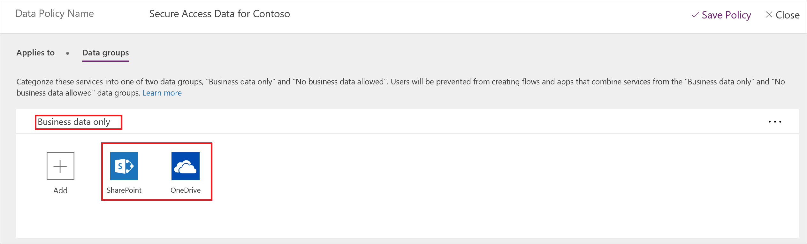
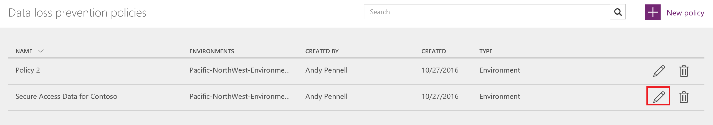
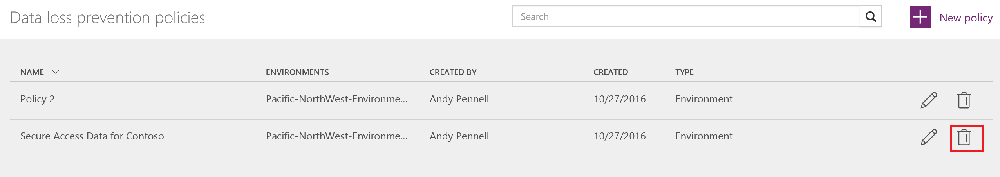
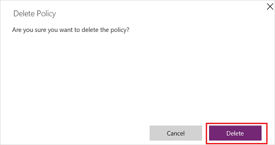

# 数据丢失防护 (DLP) 策略

组织的数据是取得成功的关键所在。 其数据需要随时可用于决策，但必须受到保护，避免与无权访问这些数据的受众共享。 为保护这些数据，Microsoft PowerApps (PowerApps) 提供了创建和实施策略的功能，这些策略用于定义可共享的特定于消费者服务/连接器的业务数据。 这些用于定义如何共享数据的策略称为数据丢失防护 (DLP) 策略。  

## 为何要创建 DLP 策略？
创建 DLP 策略能够明确定义可共享的消费者服务业务数据。 例如，使用 PowerApps 的组织可能不希望其存储在 SharePoint 中的业务数据自动发布到其 Twitter 源。 为防止出现这种情况，可创建 DLP 策略，阻止将 SharePoint 数据用作推文源。

DLP 策略的优点：
* 确保在整个组织中以统一的方式管理数据  
* 防止将重要业务数据意外发布到社交媒体站点等服务。   

## 管理 DLP 策略
### 先决条件
若要创建、编辑或删除 DLP 策略，需要满足以下条件：

* 拥有环境管理员或租户管理员权限。 可通过[环境主题](environments-administration.md)了解有关权限的详细信息

### 创建 DLP 策略
若要创建 DLP 策略，必须拥有至少一个环境的相应权限。  

按照以下步骤创建一个 DLP 策略，防止存储在 SharePoint 数据库中的数据发布到 Twitter：  

1. 在“数据策略”选项卡中，选择“新建策略”链接：  
       
2. 在打开的页面顶部的“数据策略名称”标签中，输入“Contoso 安全数据访问”作为 DLP 策略名称：   
     
3. 在“应用于”选项卡中选择[“环境”](environments-administration.md)。  
     
4. 选择“数据组”选项卡：  
     
5. 选择“仅业务数据”组框中的“+添加”链接：    
     
6. 从“添加服务”页中选择“SharePoint”和“Salesforce”服务：  
     
7. 选择“添加服务”按钮，将所选服务添加到允许共享业务数据的服务的列表：    
     
8. 选择“保存策略”：  
     
9. 片刻后，新 DLP 策略将显示在数据丢失防护策略列表中：  
     
10. **可选**向团队发送一封电子邮件或其他通讯，提醒他们有新的 DLP 策略可用。

恭喜！现已创建一个允许应用在 SharePoint 与 Saleforce 之间共享数据，并阻止与其他任何服务共享数据的 DLP 策略。  

### 查找 DLP 策略
#### 管理员
管理员可使用搜索功能从管理中心查找特定的 DLP 策略。  

> [!NOTE]
> 管理员应发布所有 DLP 策略，以便组织中的用户在创建 PowerApps 前就注意到这些策略。

#### 创建者
如果没有管理员权限并希望详细了解组织中的 DLP 策略，请与管理员联系。 也可以通过[创建者环境主题](environments-overview.md)了解详细信息  

> [!NOTE]
> 只有管理员才能编辑或删除 DLP 策略。  

### 编辑 DLP 策略
1. 通过浏览到 https://admin.powerapps.com，启动管理中心。   
2. 在启动的管理中心内，选择左侧的“数据策略”链接。  
     
3. 搜索现有 DLP 策略的列表，选择要编辑的策略旁边的编辑链接：  
     
4. 执行所需更改。 例如，可修改环境或者数据组中的服务。  
5. 选择“保存策略”保存所做更改：  
     

策略现已更新。 在数据丢失防护策略列表中找到该策略并检查其属性，即可确认是否已进行更改。   

### 删除 DLP 策略
1. 通过浏览到 https://admin.powerapps.com，启动管理中心    
2. 在启动的管理中心内，选择左侧的“数据策略”链接。  
     
3. 搜索现有 DLP 策略的列表，选择要删除的策略旁边的删除链接：  
     
4. 选择“删除”按钮，以确认要删除该策略：  
     

策略现已删除。 在左侧选择“数据策略”链接并查看策略列表，即可确认该策略是否已不在数据丢失防护策略列表中。   

### DLP 策略权限
只有租户管理员和环境管理员可以创建和修改 DLP 策略。 通过[环境主题](environments-administration.md)了解有关权限的详细信息。  

## 后续步骤
* [详细了解环境](environments-administration.md)  
* [深入了解 Microsoft PowerApps](getting-started.md)  
* [深入了解管理中心](introduction-to-the-admin-center.md)  

