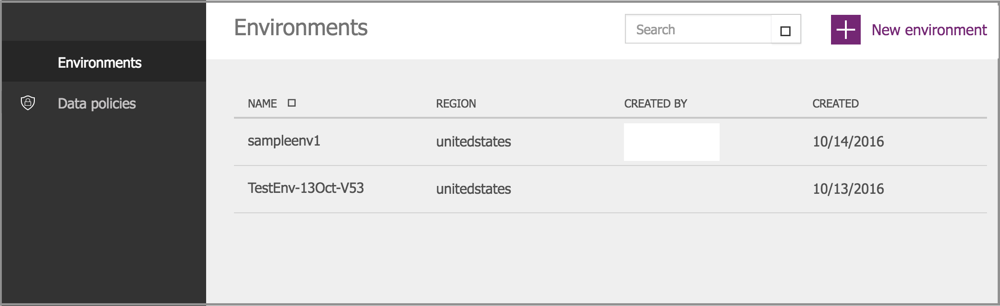

# PowerApps 中的区域概述
## 如何确定我的应用的部署位置？
应用部署在可托管环境的区域内。 例如，如果环境是在欧洲区域内创建，那么应用会部署在欧洲数据中心内。

如果你是管理员，可以在 PowerApps 管理中心内确定每个环境的托管区域。

* 转到[“管理中心”](https://admin.powerapps.com)，然后使用工作帐户登录。
  
    在管理中心内，现有的所有环境都列在“环境”选项卡中。此列表显示了应用的部署**区域**：
  
   

## 可用区域有哪些？
* 美国
* 加拿大
* 欧洲
* 亚洲
* 澳大利亚
* 印度
* 日本

## 给定区域的专属功能有哪些？
可以在各个区域内创建环境，然后将其绑定到相应的地理位置。 在环境中创建应用后，此应用就会部署到此地理位置的数据中心内。 这适用于在此环境中创建的任何项，包括 Common Data Service 中的数据库、应用、连接、网关和自定义连接器。

为获得最理想的效果，如果用户位于欧洲，请在欧洲区域创建并使用此环境。 如果用户位于美国，请在美国创建并使用此环境。

> [!NOTE]
> 本地数据网关不适用于印度区域或自定义环境。 必须在默认环境中创建网关。

