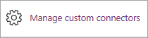
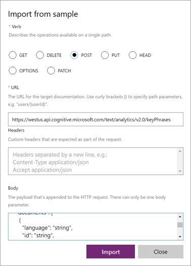
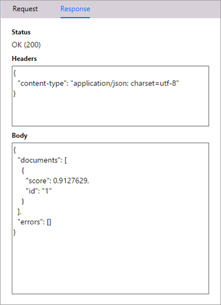
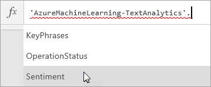

# <a name="register-and-use-custom-connectors-in-powerapps"></a>在 PowerApps 中注册和使用自定义连接器
借助 PowerApps，无需使用任何传统应用代码，即可生成功能齐全的应用。 但在某些情况下，需要扩展 PowerApps 功能，而 Web 服务则自然派上用场了。 应用可以连接服务、执行操作并传回数据。 若有要使用 PowerApps 进行连接的 Web 服务，请将此服务注册为自定义连接器。 这样一来，PowerApps 可以了解 Web API 的特性，包括需要执行的身份验证、支持的操作以及每项操作的参数和输出。

本主题将逐步介绍如何注册和使用自定义连接器，我们将以 Azure 认知服务[文本分析 API](https://www.microsoft.com/cognitive-services/en-us/text-analytics-api) 为例。 此 API 可以标识向其传递的文本的语言、情绪和关键短语。 下图展示了此服务、我们通过此服务创建的自定义连接器以及调用 API 的应用之间的交互。


## <a name="prerequisites"></a>必备组件
* [PowerApps 帐户](https://powerapps.microsoft.com)。
* JSON 格式的 OpenAPI 文件、OpenAPI 定义 URL 或 API 的 Postman 集合。 如果你没有其中任一内容，我们将为你提供指南。
* 用作自定义连接器图标的图像（可选）。

## <a name="steps-in-the-custom-connector-process"></a>自定义连接器流程步骤
自定义连接器流程有多项步骤，我们将在下面进行简要介绍。 本文假设你已有可对其进行某种验证的访问的 RESTful API，因此我们将在本文的剩余部分中重点介绍第 3-6 步。 有关第 1-2 步的示例，请参阅[创建适用于 PowerApps 的自定义 Web API](customapi-web-api-tutorial.md)。

1. 用选择的语言和平台**生成 RESTful API**。 对于 Microsoft 技术，建议使用以下技术之一。
   
   * Azure Functions
   * Azure Web 应用
   * Azure API 应用
2. 使用以下身份验证机制之一**保护 API**。 可以允许对 API 进行未经身份验证的访问，但不建议这样做。
   
   * Azure Active Directory。 有关详细信息，请参阅[在 PowerApps 中将 Azure Active Directory 与自定义连接器结合使用](customapi-azure-resource-manager-tutorial.md)。
   * 适用于 Dropbox、Facebook 和 SalesForce 等特定服务的 OAuth 2.0
   * 通用 OAuth 2.0
   * API 密钥
   * 基本身份验证
3. 采用两种行业标准方式之一**描述 API**，以便 PowerApps 可以连接它。
   
   * OpenAPI 文件（亦称为“Swagger 文件”）
   * Postman 集合
     
     也可以在第 4 步的注册过程中生成 OpenAPI 文件。
4. 使用 PowerApps 中的向导**注册自定义连接器**，可以在向导中指定 API 说明、安全详细信息和其他信息。
5. 在应用中**使用自定义连接器**。 在应用中创建与 API 的连接，并调用 API 提供的任何操作，就像在 PowerApps 中调用本机函数一样。
6. **共享自定义连接器**，就像在 PowerApps 中共享其他数据连接一样。 虽然此为可选步骤，但通常有必要跨多个应用创建者共享自定义连接器。

## <a name="describe-your-api"></a>描述 API
假设已有可对其进行某种验证的访问的 API，所以需要使用一种方法来描述 API，以便 PowerApps 可以连接它。 为此，可以从*任意* REST API 终结点创建 OpenAPI 文件或 Postman 集合，具体包括：

* 公用 API。 部分示例包括 [Spotify](https://developer.spotify.com/)、[Uber](https://developer.uber.com/)、[Slack](https://api.slack.com/)、[Rackspace](http://docs.rackspace.com/)，等等。
* 创建并部署到任意云托管提供程序（包括Azure、Amazon Web Services (AWS)、Heroku、Google Cloud 等）的 API。
* 在网络上部署的自定义业务线 API，前提是在公共 Internet 上公开该 API。

虽然 OpenAPI 文件和 Postman 集合使用的格式不同，但两者都是与语言无关的机器可读文档，其中描述了 API 操作和参数：

* 可以使用各种工具生成这些文档，具体视生成 API 时使用的语言和平台而定。 有关 OpenAPI 文件的示例，请参阅[文本分析 API 文档](https://westus.dev.cognitive.microsoft.com/docs/services/TextAnalytics.V2.0/export?DocumentFormat=Swagger&ApiName=Azure)。
* 如果还没有为 API 提供 OpenAPI 文件，也不想创建此文件，仍可以使用 Postman 集合轻松创建自定义连接器。 有关详细信息，请参阅[创建 Postman 集合](postman-collection.md)。
* 由于 PowerApps 最终会在幕后使用 OpenAPI，因此 Postman 集合会被分析并转换成 OpenAPI 定义文件。

**注意**：文件必须小于 1 MB。

### <a name="getting-started-with-openapi-and-postman"></a>OpenAPI 和 Postman 入门
* 如果你刚开始接触 OpenAPI，请参阅 swagger.io 网站上的 [OpenAPI 入门](http://swagger.io/getting-started/)。
* 如果你刚开始接触 Postman，请从 Postman 网站安装 [Postman 应用](https://www.getpostman.com/apps)。
* 如果 API 是使用 Azure API 应用或 Azure Functions 生成，请参阅[将 Azure 托管的 API 导出到 PowerApps 和 Microsoft Flow](https://docs.microsoft.com/azure/app-service/app-service-export-api-to-powerapps-and-flow)，了解详细信息。

## <a name="register-your-custom-connector"></a>注册自定义连接器
现在，使用 OpenAPI 文件或 Postman 集合在 PowerApps 中注册自定义连接器。

1. 在 [powerapps.com](https://web.powerapps.com) 的左侧菜单中，单击“连接”。 依次选择省略号（“...”）和右上角的“管理自定义连接器”。
   
     **提示**：如果在移动浏览器中找不到自定义连接器的管理位置，可能是位于左上角的菜单下方。
   
      
2. 选择“创建自定义连接器”。
   
    
3. 在“常规”选项卡上，选择自定义连接器的创建方式。
   
   * 上载 OpenAPI 文件
   * 使用 OpenAPI URL
   * 上载 Postman 集合 V1
     
     
     
     上载自定义连接器的图标。 “说明”、“主机”和“基 URL”字段通常由 OpenAPI 文件中的信息进行自动填充。 如果未自动填充，可以手动将其中的信息添加到这些字段。 选择“继续”。
4. 在“安全性”选项卡中，输入所有身份验证属性。
   
    
   
   * 身份验证类型是根据 OpenAPI `securityDefinitions` 对象中定义的内容进行自动填充。 下面是 OAuth2.0 示例。
     
       ```
       "securityDefinitions": {
           "AAD": {
           "type": "oauth2",
           "flow": "accessCode",
           "authorizationUrl": "https://login.windows.net/common/oauth2/authorize",
           "scopes": {}
           }
       },
       ```
   * 如果 OpenAPI 文件未使用 `securityDefintions` 对象，则无需输入其他任何值。
   * 如果使用的是 Postman 集合，仅在使用支持的身份验证类型（如 OAuth 2.0 或 Basic）时，才会自动填充身份验证类型。
   * 有关如何设置 Azure Active Directory (AAD) 身份验证的示例，请参阅[创建适用于 PowerApps 的自定义 Web API](customapi-web-api-tutorial.md#set-up-azure-active-directory-authentication)。
5. “定义”选项卡中会自动填充 OpenAPI 文件或 Postman 集合中定义的所有操作，以及请求和响应值。 如果所有必需操作均已定义，请转到注册过程中的第 6 步，无需在此屏幕上进行任何更改。
   
    
   
    如果要编辑现有操作或向自定义连接器添加新操作，请继续阅读下面的内容。
   
   1. 如果要添加 OpenAPI 文件或 Postman 集合中没有的新操作，请选择左侧窗格中的“新建操作”，然后在“常规”部分中填写操作的名称、说明和公开范围。
   2. 在“请求”部分中，选择右上角的“从示例导入”。 在右侧窗体中，粘贴示例请求。 示例请求通常位于 API 文档中，可以使用其中的信息来填充“谓词”、“请求 URL”、“标头”和“正文”字段。 有关示例，请参阅[文本分析 API 文档](https://westus.dev.cognitive.microsoft.com/docs/services/TextAnalytics.V2.0/operations/56f30ceeeda5650db055a3c6)。
      
       
   3. 选择“导入”，完成请求定义。 以类似的方式定义响应。
6. 定义完所有操作后，请选择“创建”，创建自定义连接器。
7. 创建自定义连接器后，请转到“测试”选项卡，测试 API 中定义的操作。 选择一个连接，然后提供输入参数来测试操作。
   
    
   
    如果调用成功，将返回有效响应。
   
    

## <a name="use-your-custom-connector"></a>使用自定义连接器
至此，已经注册了 API，可将自定义连接器添加到应用中，就像添加其他任何数据源一样。 我们将以一个简单示例为例。 有关数据连接的详细信息，请参阅[在 PowerApps 中添加数据连接](add-data-connection.md)。

1. 在 PowerApps Studio 中，单击或点击右侧窗格中的“添加数据源”。
   
    
2. 单击或点击已创建的自定义连接器。
   
    
3. 完成登录要连接的服务所需的全部步骤。 如果 API 使用 OAuth 身份验证，可能会看到登录屏幕。 如果使用的是 API 密钥身份验证，系统可能会提示你输入密钥值。
4. 在应用中调用 API。 以我们为例，我们创建的应用可以将文本提交到认知服务，并返回介于 0 到 1 之间的情绪得分（应用以百分比的形式显示得分）。
   
   * 使用此连接器，如果开始在编辑栏中键入“Az”，可以查看此 API 及其提供的操作。
     
       
   * 完整的调用如下所示，其中我们从 `TextInput` 控件传递文本，然后应用中会显示返回的得分：
     
       ```
       'AzureMachineLearning-TextAnalytics'.Sentiment({documents:Table({language:"en",id:"1",text:TextInput.Text})}).documents.score)
       ```
   * 虽然我们要在应用中多执行一些操作来处理返回的数据，但并不太复杂。

完成的应用如下图所示。 虽然这是一个简单应用，但可以通过自定义连接器调用认知服务，从而实现强大的功能。


### <a name="quota-and-throttling"></a>配额和限制
* 有关自定义连接器创建配额的详细信息，请参阅 [PowerApps 定价](https://powerapps.microsoft.com/pricing/)页。 与你共享的自定义连接器不计入此配额。
* 对于在自定义连接器中创建的每个连接，用户每分钟最多可以发出 500 个请求。

## <a name="share-your-custom-connector"></a>共享自定义连接器
至此，已拥有自定义连接器，可以与组织中的其他用户进行共享。 请注意，共享 API 后，其他用户可能会开始依赖它，而删除自定义连接器则会删除与此 API 的所有连接。 如果要为组织以外的用户提供连接器，请参阅[有关在 PowerApps 中验证自定义连接器的概述](api-connector-overview.md)。

1. 在 [powerapps.com](https://web.powerapps.com) 的左侧菜单中，单击“连接”。 依次选择省略号（“...”）和右上角的“管理自定义连接器”。
   
    
2. 依次选择连接器的省略号（“...”）按钮和“查看属性”。  
   
    
3. 选择你的 API，选择“共享”，然后输入要向其授予该 API 访问权限的用户或组。  
   
    
4. 选择“保存”。

## <a name="next-steps"></a>后续步骤
[了解如何创建 Postman 集合](postman-collection.md)

[使用 ASP.NET Web API](customapi-web-api-tutorial.md)。

[注册 Azure 资源管理器 API](customapi-azure-resource-manager-tutorial.md)。

