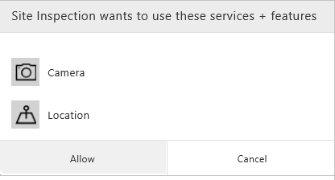

# 在 Web 浏览器中使用 PowerApps
如果在 PowerApps 中创建了应用，则可在浏览器中运行该应用，方法是打开 [Dynamics 365](https://home.dynamics.com)，然后在主页上单击或点击应用的磁贴。

> [!NOTE]
> 若对 Dynamics 365 应用（如“销售”）有疑问，可以大致了解一下 [Microsoft Dynamics 365](https://docs.microsoft.com/en-us/dynamics365/)，也可以[联系支持人员](https://www.microsoft.com/en-us/dynamics365/contact-us)。

支持以下浏览器和操作系统：

| **浏览器** | **操作系统** |
| --- | --- |
| Google Chrome（最新版本） （建议） |Windows 7 SP1、8.1 和 10  macOS  iOS 8 或更高版本 Android |
| Microsoft Edge（最新版本） （建议） |Windows 10 |
| Microsoft Internet Explorer 11（关闭兼容性视图） |Windows 7 SP1、8.1 和 10 |
| Mozilla Firefox（最新版本） |Windows 7 SP1、8.1 和 10   Android  macOS |
| Apple Safari（最新版本） |macOS   iOS 8 或更高版本 |

如果浏览器不支持应用中使用的任何控件，请下载适用于 iOS 或 Android 的 PowerApps，在移动设备（如手机）上使用它。

## 在主页上查找应用
主页上可能显示多种类型的商业应用，可通过在搜索框中键入至少一部分名称来找到特定应用。 还可以筛选列表以仅显示 PowerApps 中创建的应用。

如果最近安装了应用，该应用可能不会立即显示在应用列表中。 单击或点击“同步”可显示所有应用，但此过程可能需要一分钟的时间。

## 从任务窗格打开应用
找到应用后，可将其固定到任务窗格，便于访问。 若要固定应用，请在应用磁贴上单击或点击省略号 (...)，然后单击或点击“固定此应用”。

应用随后显示在“我的应用”下的任务窗格中，通过在左上角单击或点击“Dynamics 365”可打开此任务窗格。

## 从 URL 打开应用
另外，还可在浏览器中将应用的 URL 另存为书签，或通过电子邮件以链接形式发送 URL。 如果其他人在 PowerApps 中创建了应用并与你共享该应用，则可通过单击或点击收到的电子邮件中的链接来运行该应用。 无论以上何种情况，系统都可能提示使用 Azure Active Directory 凭据登录。

## 连接到数据
如果应用需要连接数据源，或必须征得同意才能使用设备功能，则系统会提示先执行所需操作，然后才能使用应用：  

通常情况下，只会在首次连接时看到提示。

## 关闭应用
若要关闭应用，请退出 Dynamics 365 主页，或打开其他应用。
