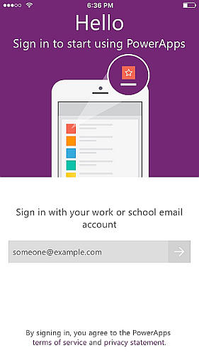
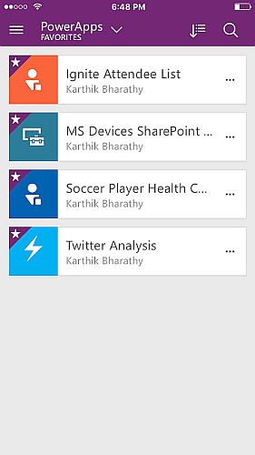
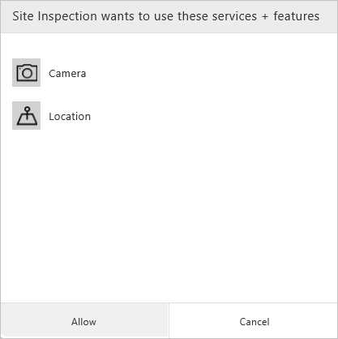

# 在手机或平板电脑上使用 PowerApps
使用 PowerApps 生成的应用可以在 Windows、iOS、Android、Windows Phone 或 Web 浏览器中运行。 在移动设备上运行的应用可以利用移动设备功能，如定位和照相机。 可以从 Windows 应用商店、App Store 或 Google Play 下载 PowerApps Mobile。

## 开始之前的准备工作
* 拥有下列一种应用：
  * 你通过[模板](get-started-test-drive.md)、[数据](get-started-create-from-data.md)或[空白画布](get-started-create-from-blank.md)生成的应用。
  * 其他人生成并与你共享的应用，且授予你用户权限。
* 已在 iPhone、iPad、Windows Phone 或 Android 设备上安装 PowerApps。 以下是受支持的特定版本：  
  * iOS 9.3 及更高版本
  * Android 5 及更高版本
  * Windows 10 移动版（预览版）

如果不熟悉 PowerApps，请参阅 [PowerApps 简介](getting-started.md)。

## 登录到 PowerApps
首次打开 PowerApps 时，系统会提示你使用 Azure Active Directory 凭据登录：  

## Windows 10 移动版（预览版）
应用商店中提供适用于 Windows 10 移动版的 PowerApps 预览版。 也可以转到 [powerapps.com](https://powerapps.microsoft.com/)，单击页面底部的 Windows 应用商店链接。

以下是系统要求：

* **操作系统**：必须安装周年更新 Redstone 1 (10.0.14267.1002) 或更高版本
* **内存**：至少 2GB RAM

## 应用筛选器和排序选项
可通过搜索以下类别之一快速查找应用：

* **全部**：你有权访问的所有应用，包括你创建的应用和其他人与你共享的应用。
* **我的应用**：至少运行一次的应用。
* **示例**：Microsoft 提供的示例应用，通过虚构数据展示真实的应用程序应用场景，有助于你发现无限可能的设计创意。
* **收藏夹**：你使用每个应用的“…”选项标记的应用。 可以通过取消标记应用，将其从此列表中删除。
  
    

选择列表后，你还可以按应用最后一次打开或修改日期对列表进行排序。 关闭和重新打开 PowerApps 后，这些首选项会予以保留。  

## 打开应用
若要在平板电脑或手机上打开应用，请点击相应的应用图标，或点击某人与你共享应用后显示的推送通知。

首次使用 PowerApps 时，会看到提示通过轻扫手势退出 PowerApps 的屏幕。

## 同意
如果应用需要连接数据源，或必须征得同意才能使用设备功能，你必须先确认连接或予以同意，然后才能使用应用：  

通常情况下，你只会在首次连接时看到提示。

## 退出应用
* 在 Android 手机上，向右侧滑动（或按“后退”按钮，然后确认自己想要退出应用）。
* 在 iPhone 上，向右侧滑动。
* 在 Windows 10 移动版上，按“后退”按钮。

## 共享应用
若要了解如何从 [powerapps.com](https://web.powerapps.com) 共享应用，请参阅[共享应用](share-app.md)。

## 将应用固定到主屏幕
可以将已下载且至少使用了一次的应用固定到设备的主屏幕上，以便快速访问。 依次点击应用的省略号 (...) 选项和“**固定**”，然后按显示的说明操作。

