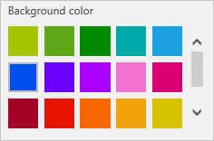

# 在 PowerApps 中更改应用名称和图标
通过更改名称和磁贴自定义应用。

## 先决条件
1. 创建应用或打开应用进行编辑。

2. 在“**文件**”菜单上，单击或点击“**应用设置**”。

## 重命名应用
在“**应用名称**”下，单击或点击“**重命名此应用**”，然后键入一个不同的名称。

## 更改应用磁贴
请按照一个或多个以下步骤操作：

* 从选项列表中单击或点击不同的背景色。

    

* 从默认图标列表中单击或点击一个图标。

    

* 单击或点击“**浏览文件**”，再单击或点击想要使用的图像，然后单击或点击“**打开**”。

    > [!NOTE]
> 为获得最佳结果，请使用方形图标。

## 下一步
在“**文件**”菜单上，单击或点击“**保存**”，以重新发布采用新设置的应用。

## 更多资源
* [共享应用](share-app.md)
* [删除应用](delete-app.md)
* [将应用还原到之前的版本](restore-an-app.md)
