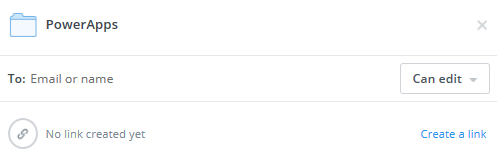
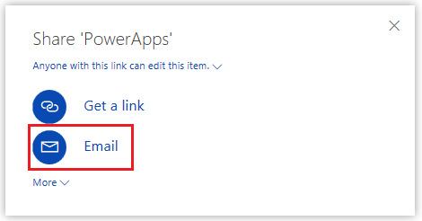
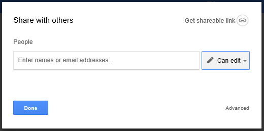

# 共享应用中使用的 Excel 数据
在[云帐户](connections/cloud-storage-blob-connections.md)（如 OneDrive）中可以与你的应用用户们共享 Excel 数据。

例如，你可以创建一个应用，显示公司技术支持小组成员的姓名和电话号码。 该信息存储在 Dropbox 中一个文件夹内的一张 Excel 电子表格中。 然后与你的应用用户共享该文件夹，以便他们能够查看成员的姓名和电话号码。

必须共享数据，以便用户能够运行甚至修改你的应用。 未被授予共享权限的用户将无法查看 Excel 文件中的数据。

本主题演示如何使用 Dropbox、OneDrive 和 Google Drive 共享 Excel 电子表格中的数据。 要创建一个应用来显示 Excel 文件中的数据，请参阅[基于一组数据创建应用](get-started-create-from-data.md)。

## 在 Dropbox 中共享数据
1. 使用创建从 PowerApps 到 Dropbox 的连接时所用的帐户登录 Dropbox。
2. 选择包含 Excel 文件的文件夹，然后选择“共享”：  
   
    
3. 在对话框中，输入应用用户登录 Dropbox 所用的电子邮件地址。  
   
    
4. 如果应用用户将在应用中添加、修改或删除数据，请选择“可编辑”。 否则，请选择“可查看”。
5. 选择“共享”。

有关详细信息，请参阅[在 Dropbox 上共享文件夹](https://www.dropbox.com/en/help/19)。

## 在 OneDrive 中共享数据
1. 使用在创建从 PowerApps 到 OneDrive 的连接时所用的帐户登录 OneDrive。
2. 选择包含文件的文件夹，然后选择“共享”：  
   
    
   
    注意：在 OneDrive for Business 中，共享文件本身，而非包含文件的文件夹。
3. 在对话框中，选择“电子邮件”。
   
    
4. 指定应用用户登录 OneDrive 所用的电子邮件地址，然后选择“共享”。  
   
    

有关详细信息，请参阅[共享 OneDrive 文件和文件夹](https://support.office.com/article/Share-OneDrive-files-and-folders-and-change-permissions-9fcc2f7d-de0c-4cec-93b0-a82024800c07)。

## 在 Google Drive 中共享数据
1. 使用创建从 PowerApps 到 Google Drive 的连接时所用的帐户登录 Google Drive。
2. 右键单击存储 Excel 文件的文件夹，然后选择“共享”。  
   
    
3. 在对话框中，输入应用用户登录 Google Drive 所用的电子邮件地址：  
   
    
4. 如果应用用户将在应用上添加、修改或删除数据，请在权限列表中选择“可编辑”。 否则，请选择“可查看”。
5. 选择“完成”。

有关详细信息，请参阅[共享 Google Drive 文件和文件夹](https://support.google.com/drive/answer/2494822)。

## 已知的限制
若要了解如何在组织内共享 Excel 数据，请[查看这些限制](connections/cloud-storage-blob-connections.md#sharing-excel-tables)。

