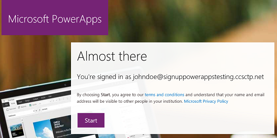
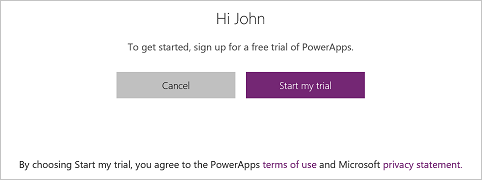

# 自助完成 PowerApps 注册
以个人身份注册 PowerApps 非常容易！ 本文逐步介绍了如何快速创建 PowerApps 免费试用版帐户。

有关管理的信息，请参阅 [为组织购买 PowerApps](signup-for-powerapps-admin.md) 或 [组织中的 PowerApps 问答](signup-question-and-answer.md)。

> **注意** 如果你在组织中，个人注册可能被禁用。 如果看到指明个人注册已禁用的错误消息，请参阅（本主题中的）[个人注册已禁用](#Individual-sign-up-turned-off)部分，了解详细信息。
> 
> 

## 哪些电子邮件地址可用
要注册 PowerApps，请输入你的工作或学校电子邮件地址。

> **注意**：暂不支持使用者电子邮件服务、电信服务提供商、政府和军用地址，具体包括：  
> 
> * outlook.com、hotmail.com、gmail.com 等  
> * .gov 和.mil
> 
> 

如果尝试注册个人电子邮件地址，则会出现一条消息，指示必须使用工作或学校电子邮件地址。

## 通过 Office 365 或 Dynamics 365 访问
选择包括 PowerApps 的 Office 365 和 Dynamics 365 计划，因此如果已拥有访问权限，只需登录即可。 请参阅 [PowerApps 定价][3]，确定许可证是否包括 PowerApps。

如果 Office 365 或 Dynamics 365 计划包括 PowerApps，则可以按照以下步骤对其进行访问：

1. 转到 [powerapps.microsoft.com][4]，然后选择“**登录**”。
   
    
   
    此时，系统会将你定向到 [powerapps.com][2]，可以开始使用 PowerApps 了。
   
    

## 免费试用 PowerApps 计划 2
PowerApps 未提供免费帐户，但你可以对 PowerApps 计划 2 进行为期 90 天的免费试用。 试用时间，你可以访问 PowerApps 计划 2 的所有功能。 PowerApps 计划 2 除了具有计划 1 的所有功能，它还可以访问 Common Data Service 和管理功能。 计划 2 还在 Common Data Service 中提供更高的流运行容量以及数据和文件存储容量。

### 从头开始免费试用
如果已具有通过 Office 365、Dynamics 365 或 PowerApps 计划 1 访问 PowerApps 的权限，请转到下一部分。 否则，请执行以下步骤：

1. 转到 [powerapps.microsoft.com][4]，然后视需要选择执行以下操作之一：
   
   * 在右上角附近，单击或点击“**免费注册**”。
     
       如果是在手机上查看此内容，请单击或点击右上角的菜单图标，然后单击或点击“**免费注册**”。
     
       
   * 选择“**定价**”（靠近屏幕中间），然后选择“**开始免费试用**”。
     
     
2. 在“**入门**”下，键入工作或学校电子邮件地址，然后单击或点击“**提交**”。  
   
    
3. 如果你的帐户在组织内不存在，则会收到一条消息，提示查看电子邮件：
   
    
   
    如果你的帐户是现有组织的一部分，则会收到一条消息，要求使用该帐户登录。 选择“**登录**”，使用你的工作帐户登录：  
   
    
4. 如果收到一封电子邮件，请单击该邮件内的链接以验证电子邮件地址。 验证地址后，可能需要输入一些其他个人信息。
5. 如果你有现有的组织帐户，则会看到一条消息，要求选择“**开始**”：  
   
6. 此时，系统会将你定向到 [powerapps.com][2]，可以开始使用 PowerApps 了。
   
    

### 从 PowerApps 内开始免费试用
如果已具有作为 Office 365、Dynamics 365 或 PowerApps 计划 1 的用户访问 PowerApps 的权限，则可以免费试用 PowerApps 计划 2。 要开始计划 2 为期 90 天的免费试用，请登录 PowerApps，然后尝试 PowerApps 计划 2 的其中一个功能：

* [创建和管理](signup-for-powerapps-admin.md) Common Data Service 的实例。
* 使用 Common Data Service 进行[数据建模](data-platform-intro.md)。
* 在 [PowerApps 管理中心][5]内[创建和管理环境](environments-administration.md)。
* 在 PowerApps 中[管理本地数据网关](gateway-management.md)。  

尝试任一功能时，系统均会提示你开始免费试用。 只需选择“**开始我的试用**”即可。

  

要开始试用，需要通过选择“**开始我的试用**”同意使用条款。

  

**注意**

* *如果你需要更多时间来评估 PowerApps，则可以申请将试用期再延长 90 天*。
* *利用此产品内 PowerApps 试用版的用户将不在 Office 365 管理门户中显示为 PowerApps 计划 2 试用版用户（用户具有 Office 365、Dynamics 365 或 PowerApps 其他许可证的情况除外）*。
* *如果你是 IT 管理员，并且希望获取 PowerApps 试用版许可证并将其部署给组织内多个用户（无需个人用户接受条款），可以注册 [PowerApps 计划 2 订阅试用版][6]。必须成为 Office 365 全局或计帐管理员，或者创建新租户，才能注册管理员试用版*。  [了解详细信息](signup-for-powerapps-admin.md)

## 个人注册已关闭
尝试注册 PowerApps 时，可能会遇到以下消息。

> 你的 IT 部门已关闭 Microsoft PowerApps 注册。
> 
> 

这可能是因为组织已禁用个人注册。 也可能是因为你是通过合作伙伴购买的 Office 365。 了解更多。

如果组织已禁用个人注册，请与 IT 组合作，共同为你的帐户分配 PowerApps 许可证。

## 故障排除
在许多情况下，可以按照本主题中的步骤注册 PowerApps。 但是，任意一种原因均可能导致注册失败。 下表总结了一些最常见的原因以及可以解决这些问题的方法。

| 症状/错误消息 | 原因和解决办法 |
| --- | --- |
| **个人电子邮件地址（例如，nancy@gmail.com）**     在注册过程中，你会收到一条如下所示的消息：     `You entered a personal email address: Please enter your work email address so we can securely store your company's data.`     或     `That looks like a personal email address. Enter your work address so we can connect you with others in your company. And don’t worry. We won’t share your address with anyone.` |PowerApps 不支持由使用者电子邮件服务或电信提供商提供的电子邮件地址。     要完成注册，请使用工作或学校电子邮件地址重试。 |
| **.gov 或 .mil 地址**     在注册过程中，你会收到一条如下所示的消息：     `PowerApps unavailable: PowerApps is not available for users with .gov or .mil email addresses at this time. Use another work email address or check back later.`     或     `We can't finish signing you up. It looks like Microsoft PowerApps isn't currently available for your work or school.` |PowerApps 目前不支持 .gov 或.mil 地址。 |
| **自助注册已禁用**     在注册过程中，你会收到一条如下所示的消息：     `We can't finish signing you up. Your IT department has turned off signup for Microsoft PowerApps. Contact them to complete signup.`     或     `That looks like a personal email address. Enter your work address so we can connect you with others in your company. And don’t worry. We won’t share your address with anyone.` |组织的 IT 管理员已禁用 PowerApps 的自助服务注册。     要完成注册，请与 IT 管理员联系，要求他们允许用户注册 PowerApps，并且允许新用户加入你的现有租户。 |
| **电子邮件地址不是 Office 365 ID**      在注册过程中，你会收到一条如下所示的消息：     `We can't find you at contoso.com.  Do you use a different ID at work or school? Try signing in with that, and if it doesn't work, contact your IT department.` |你的组织使用电子邮件地址以外的其他 ID 登录到 Office 365 和其他 Microsoft 服务。 例如，电子邮件地址可能是 Nancy.Smith@contoso.com，但 ID 是 nancys@contoso.com。     要完成注册，请使用组织已分配给你的 ID 登录到 Office 365 或其他 Microsoft 服务。  如果你不知道这些信息，请与 IT 管理员联系。 |

## 另请参阅
[组织中的 PowerApps 问答](signup-question-and-answer.md)  
[为组织采购 PowerApps](signup-for-powerapps-admin.md)  
有更多问题？ [尝试参与 PowerApps 社区][7]

<!--Reference links in article-->
[1]: http://go.microsoft.com/fwlink/p/?LinkId=715583
[2]: http://go.microsoft.com/fwlink/p/?LinkId=708209
[3]: https://go.microsoft.com/fwlink/?linkid=832550
[4]: https://go.microsoft.com/fwlink/?linkid=832551
[5]: https://go.microsoft.com/fwlink/?linkid=832552
[6]: https://portal.office.com/Signup?OfferId=767ad45e-9508-479c-8109-2022f6ea4362
[7]: https://community.powerapps.com
