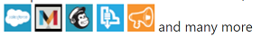
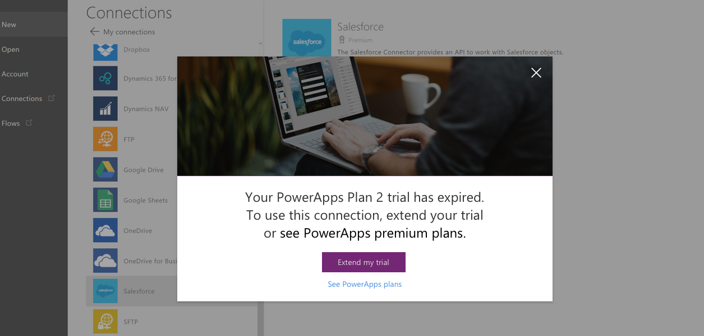

# PowerApps 计划 2 试用版
注册 PowerApps 计划 2 试用版，以获取可免费试用 90 天的所有功能。 除了从许多 [Office 365 和 Dynamics 365 计划](pricing-billing-skus.md)中获取的 PowerApps 功能外，此试用版还提供了更多容量和高级功能。 高级功能包括：

* **访问 Common Data Service**，它是内置于 PowerApps 的一个安全业务数据平台。 该服务随附上数以百计的标准业务实体，因此你的所有应用都可共享“客户”、“产品”和“销售线索”等的相同定义。 [了解详细信息](data-platform-intro.md)
* **访问高级连接**，例如 Salesforce、DB2、Zendesk 和 Common Data Service。 借助大量 Office 365 和 Dynamics 365 计划，你可以连接到 Office 365、Dynamics 365、Dropbox 和 Twitter 等数据源。 借助计划 2 试用版，你还可以通过高级连接器连接到数据，例如：
  
    
  
    在[连接器完整列表](connections-list.md)中，高级连接器与徽章一起显示：
  
    
* **访问 PowerApps 管理中心**，你可以在其中管理环境、数据库、用户权限和数据策略。  [了解详细信息](introduction-to-the-admin-center.md)

有关计划 2 试用版中的其他功能和容量的详细信息，请参阅[定价页](https://powerapps.microsoft.com/pricing/)。

可以使用工作或者学校帐户从 [PowerApps 站点](https://powerapps.microsoft.com/)注册该试用版。 如果你已具有通过 Office 365、Dynamics 365 或 PowerApps 计划 1 访问 PowerApps 的权限，在你尝试访问计划 2 功能时，系统将提示你注册此试用版。

## 试用到期后会怎样？
90 天后，系统会提示你申请将试用期延长 90 天或者购买计划。 可以在[定价页](https://powerapps.microsoft.com/pricing/)上查看所有计划的详细信息。

* 如果你已具有通过 Office 365、Dynamics 365 或 PowerApps 计划 1 访问 PowerApps 的权限，则仍可以使用 PowerApps，但是可能会失去对 Common Data Service、高级连接器、管理中心和计划 2 其他功能的访问权限。 例如，如果你尝试创建高级连接，则可能出现以下屏幕：
  
    
  
    如果你尝试修改 Common Data Service 中的架构或实体，则可能出现以下屏幕：
  
    
* 如果你只能通过试用版（你已在 [PowerApps 站点](http://powerapps.microsoft.com/)或[定价页](http://powerapps.microsoft.com/pricing)上进行注册）访问 PowerApps，则在你尝试访问 PowerApps 时将出现如下所示的屏幕：
  
    

## 距离试用到期还剩多少天？
很快你就可以看到距离你的试用到期还剩多少天。

## 试用到期后，我的数据会怎样？
如果你仍然具有对 PowerApps 的访问权限，则可以继续使用它。 Common Data Service 中的所有数据均将保留原样，并且将 Common Data Service 用作数据源的所有应用或流均继续按照以前的方式运行。 但是你将无法使用该应用或流，如果你尝试修改 Common Data Service 中的架构或实体，系统将提示你申请延长试用期或购买计划。

## 接下来我应该怎么做？
你可以按照以下步骤之一操作来保留对 PowerApps 及其功能的访问权限：

* 出现提示后，申请将试用期再延长 90 天。
* 购买计划。 可以查看可用计划或访问 PowerApps 定价页。 [详细了解](signup-for-powerapps-admin.md)如何购买计划。

