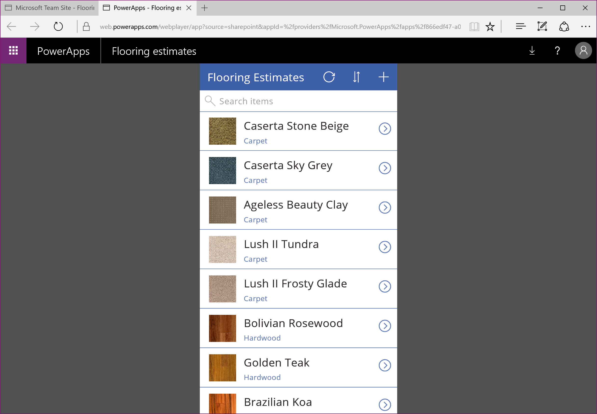
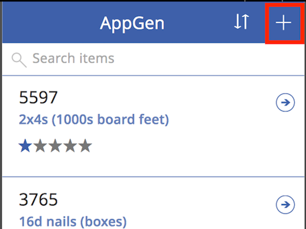
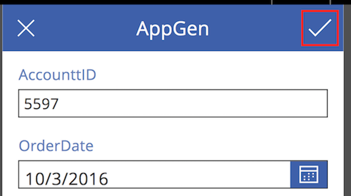
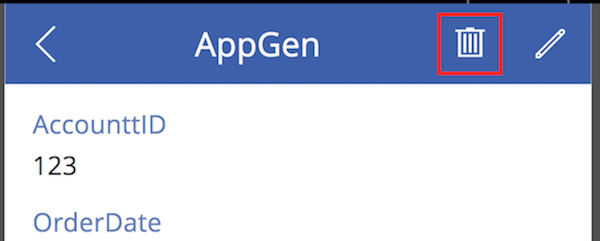

# 从 SharePoint Online 列表打开应用
可在 SharePoint Online 内打开现有应用，并管理列表。

有关 SharePoint 数据 PowerApps 支持的信息类型，请参阅[已知问题](../maker/canvas-apps/connections/connection-sharepoint-online.md#known-issues)。

## 先决条件
[在 SharePoint 界面中创建应用](../maker/canvas-apps/generate-app-from-sharepoint-list-interface.md)。

## 打开应用
1. 打开 SharePoint Online 列表，从列表中选择一个应用。
   
    
2. 单击或点击“打开”。
   
    
   
    将在单独的浏览器选项卡中打开应用。
   
    

## 使用应用管理列表
> [!NOTE]
> 本主题介绍如何打开和运行自动从 SharePoint 列表生成的应用。 更常见的情况是，生成的应用已进行了大量自定义以满足组织的需求。 在这种情况下，用法可能比此处介绍的方法更复杂。
> 
> 

1. 如之前的过程所述，打开应用。
2. 若要向列表添加项，请单击或点击“+”号。
   
    
3. 将出现一个窗体，可在其中输入列表各字段中的值。 完成后，单击或点击复选标记。
   
    
4. 若要查看某项的详细信息，请单击或点击箭头。
   
    
5. 若要编辑该项，请在显示的窗体中，单击或点击“铅笔”。
   
    
6. 进行更改，然后单击或点击复选标记。
   
    
7. 若要删除某项，请从详细信息视图屏幕，单击或点击垃圾桶。
   
    

