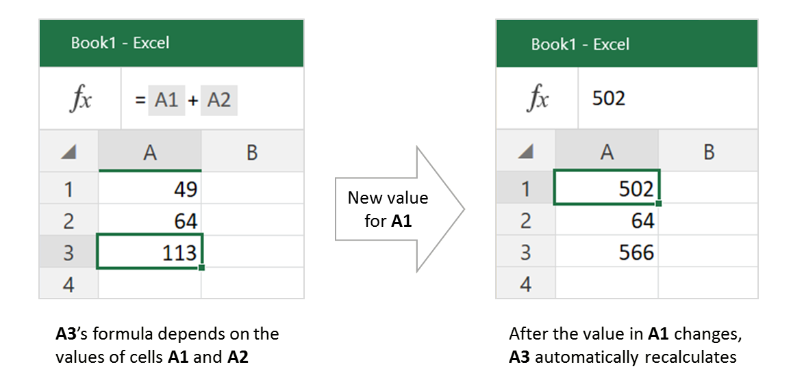
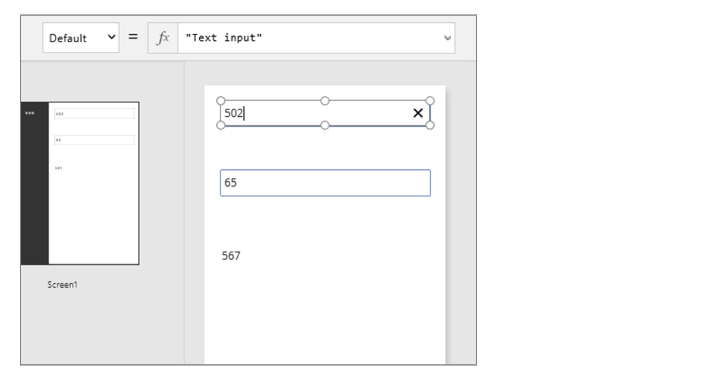
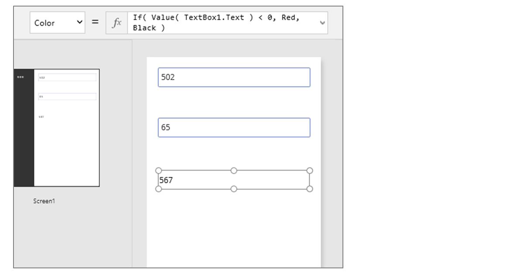
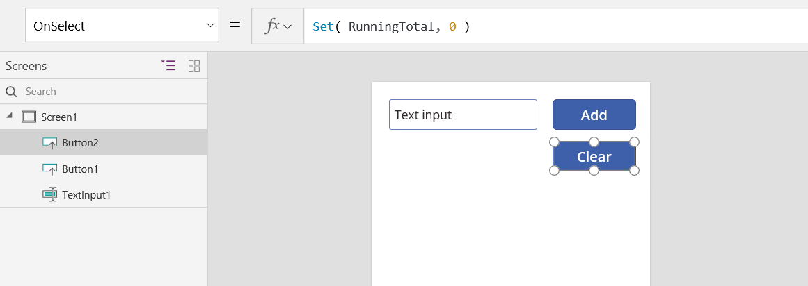
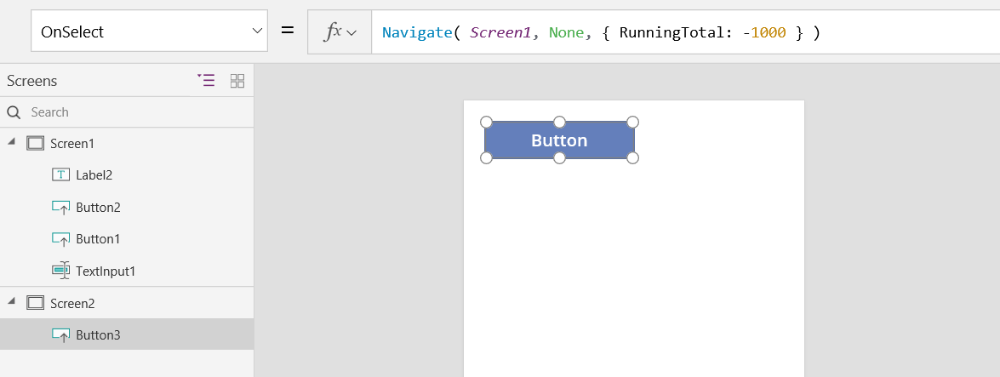
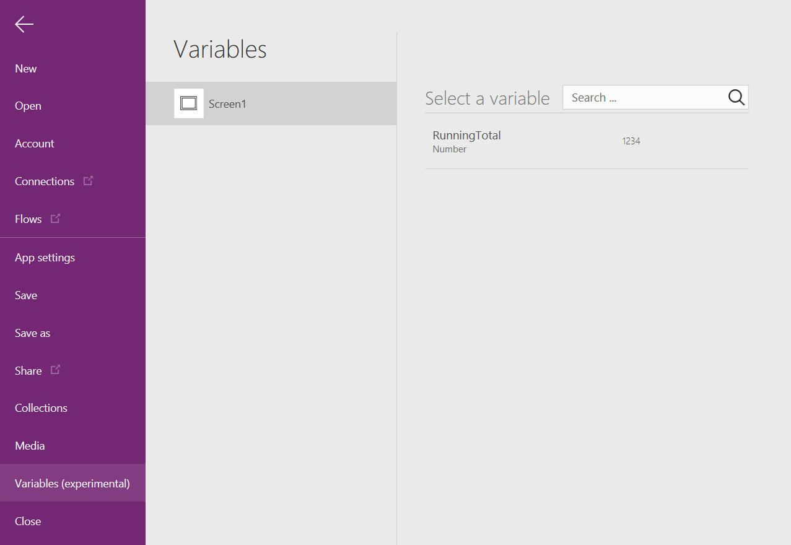
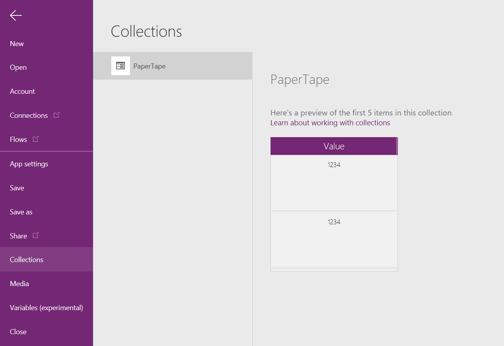
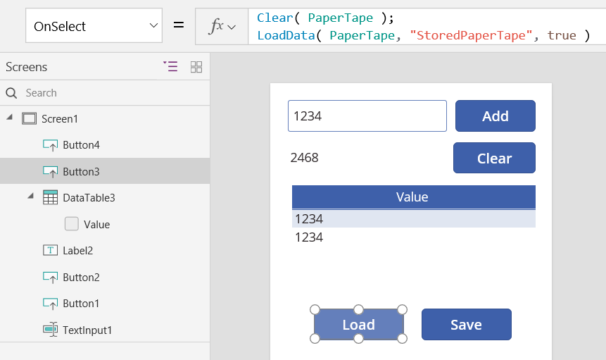
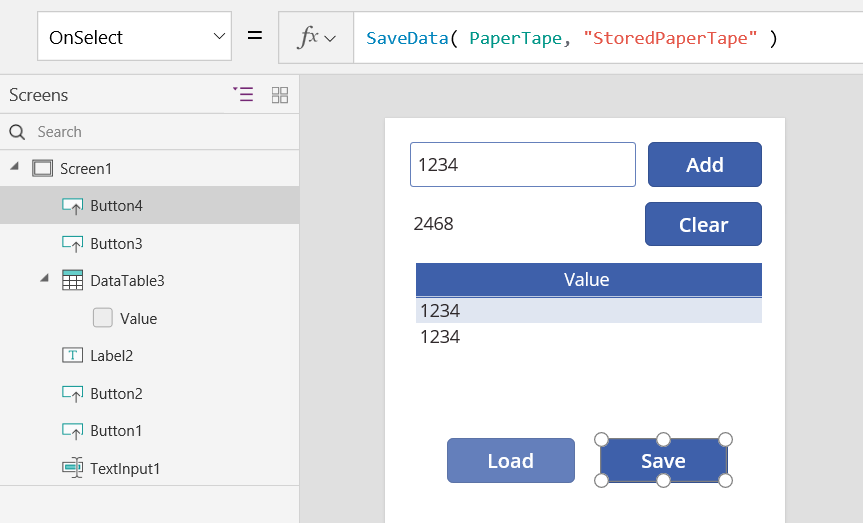

# 了解 PowerApps 中的变量
如果你使用过其他编程工具（例如 Visual Basic 或 JavaScript），你可能会问：**变量在哪里？** PowerApps 稍有不同，需要不同的方法。 与其去获取变量，不妨问自己：**我会在 Excel 中做什么？**

在其他工具中，你可能会显式执行某个计算，然后将结果存储在变量中。 但是，PowerApps 和 Excel 都会在输入数据更改时自动重新计算公式，因此你通常不需要创建和更新变量。 尽可能使用这种方法，你就可以更轻松地创建、了解和维护应用。

某些情况下，需要在 PowerApps 中使用变量，通过添加[行为公式](working-with-formulas-in-depth.md#behavior-formulas)扩展 Excel 的模型。 这些公式在特定情况下（例如，用户选择某个按钮）运行。 在行为公式中，设置一个可在其他公式中使用的变量通常很有用。

一般情况下，应避免使用变量。 但有时候，只有使用变量才能获得所需的体验。

## 将 Excel 转换成 PowerApps
### Excel
让我们回顾一下 Excel 的工作原理。 单元格可以包含值（例如数字或字符串），也可以包含公式（基于其他单元格的值）。 用户向单元格输入其他值以后，Excel 会自动根据新的值重新计算任何公式。 不需编程即可启用此行为。

Excel 没有变量。 包含公式的单元格的值随输入而更改，但无法记住公式的结果，也无法将结果存储在单元格或任何其他地方。 如果更改某个单元格的值，则整个电子表格都会更改，以前计算出来的值就会丢失。  Excel 用户可以复制和粘贴单元格，但那是在用户的手动控制之下完成的，不可能通过公式来完成。

### PowerApp
在 PowerApps 中创建的应用的行为与 Excel 很类似。 可以将控件添加到屏幕的任意位置，并根据其在公式中的用途为其命名，不需更新单元格。

例如，可以添加一个“[标签](controls/control-text-box.md)”控件，将它命名为“TextBox1”，同时还添加两个“[文本输入](controls/control-text-input.md)”控件，分别命名为“TextInput1”和“TextInput2”，这样便可以在应用中复制 Excel 行为。 如果随后将 **TextBox1** 的 **[Text](controls/properties-core.md)** 属性设置为 **TextInput1 + TextInput2**，则会始终自动显示 **TextInput1** 和 **TextInput2** 中的数字之和。

请注意，上图选中的是 **TextBox1** 控件，在屏幕顶部的公式栏中显示了其 **[Text](controls/properties-core.md)** 公式。  在这里，我们可以找到公式 **TextInput1 + TextInput2**。  该公式在这些控件之间创建了一个依赖关系，就像在 Excel 工作簿中的单元格之间创建依赖关系一样。  让我们更改一下 **TextInput1** 的值：

上图表明 **TextBox1** 的公式已自动重新计算，显示新值。

在 PowerApps 中，使用公式不仅可以确定控件的主值，还可以确定属性（例如格式设置）。 在下一示例中，标签的“[Color](controls/properties-color-border.md)”属性的公式会自动将负值显示为红色。 **[If](functions/function-if.md)** 函数看起来应该与 Excel 中的很相似：
 **If( Value(TextBox1.Text) < 0, Red, Black )**

现在，如果 **TextBox1.Text** 中的计算结果为负，则相应的数字将显示为红色：

很多情况下都可以使用公式：

* 启用设备的 GPS 后，地图控件就可以使用公式通过 **Location.Latitude** 和 **Location.Longitude** 来显示当前位置。  移动时，地图会自动跟踪你的位置。
* 其他用户可能会更新[数据源](working-with-data-sources.md)。  例如，团队中的其他人可能会更新 SharePoint 列表中的项。  刷新数据源时，相关公式会根据更新的数据自动重新计算。 就此示例来说，你可以进一步将库的 **[Items](controls/properties-core.md)** 属性设置为公式 **Filter( SharePointList )**，以便自动显示新筛选的[记录](working-with-tables.md#records)集。

### 权益
使用公式生成应用具有很多优点：

* 如果你知道 Excel，你就知道 PowerApps。 二者的模型和公式语言是相同的。
* 如果你使用过其他编程工具，可以试想一下，完成这些示例需要多少代码。  在 Visual Basic 中，需要为每个文本输入控件上发生的更改事件编写事件处理程序。  在每个这样的处理程序中，用于执行计算的代码很冗长，并且可能会出现不同步的情况，或者需要你编写通用子例程。  而在 PowerApps 中，这一切只需一个单行公式即可完成。
* 若要了解 **TextBox1** 的文本源自何处，只需查看 **[Text](controls/properties-core.md)** 属性中的公式即可。  其他方式不会影响该控件的文本。  在传统编程工具中，可以从程序的任何位置通过任何事件处理程序或子例程更改该标签的值。  这就难以跟踪变量的更改时间和位置。
* 如果用户更改了滑块控件，然后又改变了主意，则可将滑块改回其原始值。  这样一来，就好像没有做过任何更改一样：应用所显示的控件值与以前显示的一样。  不需进行分支试验并询问假设性的问题，就像在 Excel 中一样。  

如果可以使用公式达到某种效果，则通常会选择使用公式。 让 PowerApps 中的公式引擎为你服务。  

## 了解何时使用变量
让我们将简单的加法器更改一下，使之操作起来就像一台老式的带汇总功能的加法机。 如果选择“加”按钮，则会将一个数字加到汇总中。 如果选择“清除”按钮，则会将汇总重置为零。

我们的加法机使用了某个 Excel 中不存在的东西：按钮。 在该应用中，不能仅使用公式来计算汇总，因为其值取决于用户采取的一系列操作。 必须手动记录和更新汇总。 大多数编程工具将该信息存储在“变量”中。    

有时候，需要使用变量才能让应用的表现符合预期。  但该方法需注意以下事项：

* 必须手动更新汇总。 自动重新计算在此方面不会为你代劳。
* 不能再根据其他控件的值计算汇总。 汇总结果取决于用户选择“加”按钮的次数，以及每次操作时文本输入控件中的具体值。 在执行加法计算时，到底是用户输入了 77 并选择“加”两次，还是用户指定了 24 和 130？ 你只知道总和为 154，但无法分辨上述两种过程。
* 可以通过不同的方式来改变总和。 在此示例中，“加”按钮和“清除”按钮都可以更新总和。 如果应用表现异常，则到底是哪个按钮引发的问题？

## 创建全局变量
创建加法机需要一个变量来存储汇总。 可用于 PowerApps 的最简单变量是全局变量。  

全局变量的工作方式：

* 使用 [Set](functions/function-set.md) 函数设置全局变量的值。  Set( MyVar, 1 ) 可将全局变量 MyVar 的值设置为 1。
* 可以通过引用 Set 函数使用的名称来使用全局变量。  在这种情况下， MyVar 将返回 1。 
* 全局变量可以存储包括字符串、数字、记录和[表](working-with-tables.md)在内的任何值。

让我们使用全局变量重新生成加法机：

1. 添加一个文本输入控件，将其命名为 **TextInput1**，同时添加两个按钮，分别命名为 **Button1** 和 **Button2**。
2. 将 **Button1** 的 **[Text](controls/properties-core.md)** 属性设置为“加”，将 **Button2** 的“Text”属性设置为“清除”。
3. 若要在用户选择“加”按钮时更新汇总，请将 **[OnSelect](controls/properties-core.md)** 属性设置为以下公式：
   
    Set( RunningTotal, RunningTotal + Text1 )
   
    用户首次选择“添加”按钮并调用 [Set](functions/function-set.md) 后，将创建默认值为“blank”的 RunningTotal。  进行加法计算时，“空”值将被视为零。
   
    
4. 若要在用户选择“清除”按钮时将汇总设置为 **0**，请将 **[OnSelect](controls/properties-core.md)** 属性设置为以下公式：
   
    Set( RunningTotal, 0 )
   
    
5. 添加一个“[标签](controls/control-text-box.md)”控件，然后将“[Text](controls/properties-core.md)”属性设置为“RunningTotal”。
   
    此公式将自动重新计算，为用户显示的 **RunningTotal** 值随用户选择的按钮而变化。
   
    
6. 预览该应用，我们创建的加法机完全符合上述说明。  在文本框中输入数字，然后按几次“添加”按钮。  准备就绪时，使用 Esc 键返回到创作体验。  
   
    
7. 若要查看全局变量的值，请选择“文件”菜单，然后在左侧窗格中选择“变量”。
   
    
8. 若要查看其中定义和使用变量的位置，请选择它。
   
    

## 变量类型
PowerApps 中有三种类型的变量：

| 变量类型 | 范围 | 说明 | 函数 |
| --- | --- | --- | --- |
| 全局变量 |应用 |用法最为简单。  包含可从应用程序的任何位置进行引用的数字、文本字符串、布尔值、记录、表等。 |[Set](functions/function-set.md) |
| 上下文变量 |屏幕 |非常适合将值传递到屏幕，与其他语言中的过程的参数非常类似。  仅可以从一个屏幕进行引用。 |[UpdateContext](functions/function-updatecontext.md) [Navigate](functions/function-navigate.md) |
| 集合 |应用 |包含可从应用任意位置进行引用的一个表。  允许修改表的内容，而不是作为一个整体进行设置。 可以保存到本地设备，以供将来使用。 |[Collect](functions/function-clear-collect-clearcollect.md) [ClearCollect](functions/function-clear-collect-clearcollect.md) [Patch](functions/function-patch.md) [Update](functions/function-update.md) [Remove](functions/function-remove.md) [SaveData](functions/function-savedata-loaddata.md) [LoadData](functions/function-savedata-loaddata.md) 等等。 |

在 Set、UpdateContext、Navigate 或 Collect 函数中使用变量时，所有变量均将隐式创建。  如其他编程工具中的操作一样，没有显式声明的变量。  变量类型也可以基于其中放置的值隐式派生。

应用运行时，所有变量都保存在内存中。  应用关闭后，变量中保存的值将丢失。  你可以使用 Patch 或 Collect 函数将变量内容存储在数据源中，或者可以使用 SaveData 函数将集合存储到本地设备。  当首次加载应用时，所有变量将全部为空白值。

可以使用变量名称读取其值。  例如，使用 Set( MyColor, Red ) 进行定义后，即可轻松在任何可以使用颜色值的位置使用 MyVar，并将其替换为红色。  可以具有与上下文变量名称相同的全局变量或集合。  在这种情况下，上下文变量享有优先权。  你仍然可以使用[消除歧义运算符](functions/operators.md#disambiguation-operator) @[MyColor] 引用全局变量或集合。

## 创建上下文变量
我们来看看如何使用上下文变量而不是全局变量创建加法机。    

上下文变量的工作原理：

* 通过 **[UpdateContext](functions/function-updatecontext.md)** 函数创建和设置上下文变量。  如果在对某个上下文变量进行首次更新时，该变量并不存在，则会使用默认值“空”创建该变量。
* 使用记录创建和更新上下文变量。 在其他编程工具中，通常使用“=”来赋值，例如“x = 1”。  上下文变量则使用 **{ x: 1 }** 这样的形式。 使用上下文变量时，可直接使用其名称。  
* 也可使用 **[Navigate](functions/function-navigate.md)** 函数，在显示屏幕时设置上下文变量。 如果将屏幕视为一种过程或子例程，则此操作类似于其他编程工具中的参数传递。
* 上下文变量的作用范围仅限于单个屏幕的上下文（**[Navigate](functions/function-navigate.md)** 除外），这也是其得名的原因。  不能超出相应的上下文使用或设置上下文变量。
* 上下文变量可以存储包括字符串、数字、记录和[表](working-with-tables.md)在内的任何值。

让我们使用一个上下文变量重新生成加法机：

1. 添加一个文本输入控件，将其命名为 **TextInput1**，同时添加两个按钮，分别命名为 **Button1** 和 **Button2**。
2. 将 **Button1** 的 **[Text](controls/properties-core.md)** 属性设置为“加”，将 **Button2** 的“Text”属性设置为“清除”。
3. 若要在用户选择“加”按钮时更新汇总，请将 **[OnSelect](controls/properties-core.md)** 属性设置为以下公式：
   
    UpdateContext( { RunningTotal: RunningTotal + Text1 } )
   
    用户首次选择“加”按钮并调用 **[UpdateContext](functions/function-updatecontext.md)** 后，将创建默认值为“空”的 **RunningTotal**。  进行加法计算时，“空”值将被视为零。
   
    
4. 若要在用户选择“清除”按钮时将汇总设置为 **0**，请将 **[OnSelect](controls/properties-core.md)** 属性设置为以下公式：
   
    UpdateContext( { RunningTotal: 0 } )
   
    同样，**[UpdateContext](functions/function-updatecontext.md)** 与公式 **UpdateContext( { RunningTotal: 0 } )** 一起使用。
   
    
5. 添加一个“[标签](controls/control-text-box.md)”控件，然后将“[Text](controls/properties-core.md)”属性设置为“RunningTotal”。
   
    此公式将自动重新计算，为用户显示的 **RunningTotal** 值随用户选择的按钮而变化。
   
    
6. 预览该应用，我们创建的加法机完全符合上述说明。  在文本框中输入数字，然后按几次“添加”按钮。  准备就绪时，使用 Esc 键返回到创作体验。  
   
    
7. 导航到屏幕时，可以设置上下文变量的值。  这对于将“上下文”或“参数”从一个屏幕传递到另一个屏幕很有用。  要查看此内容，请插入一个新屏幕，然后插入将 OnSelect 属性设置为以下公式的按钮：
   
    Navigate( Screen1, None, { RunningTotal: -1000 } ) 
   
    
   
    在“Screen2”上选择此按钮（如果选择朝向末端的按钮，则可以在创作时执行此操作）将显示“Screen1”，还会将上下文变量 RunningTotal 设置为 -1000。
   
    
8. 若要查看上下文变量的值，请选择“文件”菜单，然后在左侧窗格中选择“变量”。
   
    
9. 要查看定义和使用上下文变量的位置，请选择它。
   
    

## 创建集合
最后，我们来看一下如何使用集合创建加法机。  由于集合包含一个易于修改的表，我们将使此加法机保留每个值输入时的“纸带”。

集合工作原理：

* 通过 **[ClearCollect](functions/function-clear-collect-clearcollect.md)** 函数创建和设置集合。  可以改用 **[Collect](functions/function-clear-collect-clearcollect.md)** 函数，但该函数实际上需要另一个变量，而不能替换旧的变量。  
* 集合是一种类型的数据源，因此也是表。 若要访问集合中的单个值，请使用 **[First](functions/function-first-last.md)** 函数，并从生成的记录中提取一个字段。 如果使用了单个值和 **[ClearCollect](functions/function-clear-collect-clearcollect.md)**，则该字段为“Value”字段，如以下示例所示： **First(** *VariableName* **).Value**

让我们使用集合重新创建加法机：

1. 添加一个**[文本输入](controls/control-text-input.md)**控件，将其命名为 **TextInput1**，同时添加两个按钮，分别命名为 **Button1** 和 **Button2**。
2. 将 **Button1** 的 **[Text](controls/properties-core.md)** 属性设置为“加”，将 **Button2** 的“Text”属性设置为“清除”。
3. 若要在用户选择“加”按钮时更新汇总，请将 **[OnSelect](controls/properties-core.md)** 属性设置为以下公式：
   
    Collect( PaperTape, TextInput1.Text )
   
    此公式会将新值添加到集合末尾。  由于我们添加了一个单值，因此，集合会自动将其置于列名为“Value”的单列中，稍后我们将使用它。
   
    
4. 若要在用户选择“清除”按钮时清除纸带，请将其 [OnSelect](controls/properties-core.md) 属性设置为以下公式：
   
    Clear( PaperTape )
   
    
5. 若要显示汇总，请添加一个标签，然后将“[Text](controls/properties-core.md)”属性设置为以下公式：
   
    Sum( PaperTape, Value )
   
    
6. 若要运行加法机，请按 F5 打开“预览”，在文本输入控件中输入数字，然后选择相应的按钮。
   
    
7. 若要返回到默认工作区，请按 Esc 键。
8. 要显示纸带，请插入“数据表”控件，并将其 [Items](controls/properties-core.md) 属性设置为此公式：
   
    PaperTape
   
    另外，还需要选择要在右侧窗格中显示的列，在此示例中为显示“Value”列：
   
    
9. 若要查看集合中的值，请在“文件”菜单上选择“集合”。
   
    
10. 要存储和检索集合，请添加两个附加按钮控件，并将其文本设置为“加载”和“保存”。  对于“加载”，请将 OnSelect 属性设置为以下公式：
    
     Clear( PaperTape ); LoadData( PaperTape, "StoredPaperTape", true )
    
     我们首先需要清除集合，因为 LoadData 会将存储的值附加到集合末尾。
    
     
11. 对于“保存”，请将 OnSelect 属性设置为以下公式：
    
     SaveData( PaperTape, "StoredPaperTape" )
    
     
12. 按 F5 键再次预览，在文本输入控件中输入数字，然后选择按钮。  选择“保存”按钮。  关闭并重新加载应用，然后选择“加载”按钮以重新加载集合。  
    
     注意：在 Web 浏览器中运行时，SaveData 和 LoadData 不起作用，你必须使用 Windows 上安装的工作室或移动设备的其中一个播放器。  

